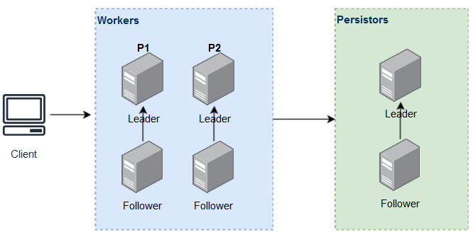

# Topiik
A middleware that for both Key/Value store and Message broker

## How Topiik works

### Workers
Maintain Topiik cluster, manage worker groups(partitions), execute commands, memory storage of key/value

### Persistors
Centralized persistence of binary logs, make scale out/in faster by reduce files copy between worker groups

## Dev environment
For setup minimum Topiik environment, need two nodes(or use different port number on same host), one Worker node and one Persistor node

## Cluster

